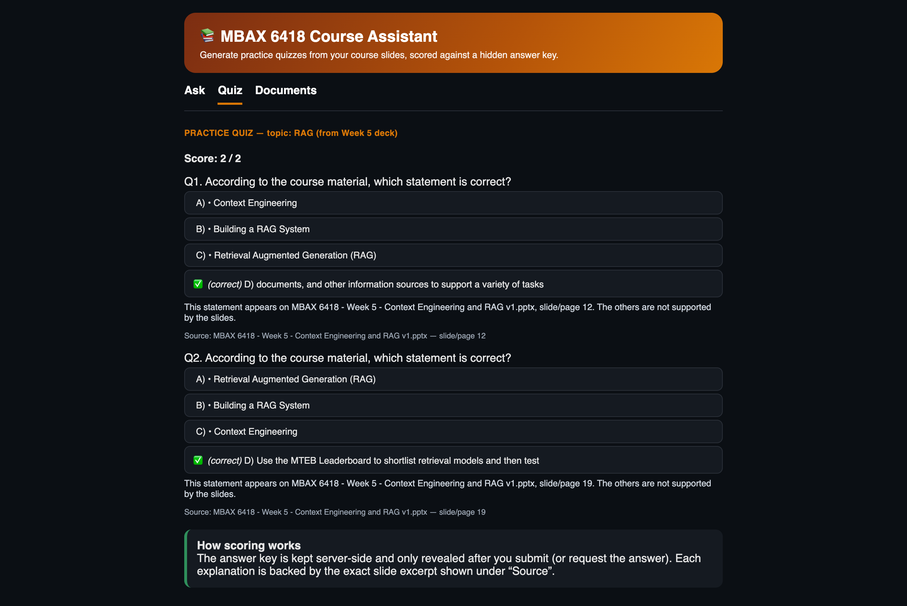
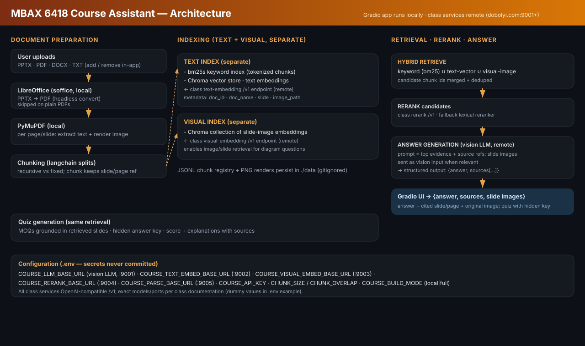

# MBAX 6418 Course Assistant (RAG Study Assistant)

A hybrid retrieval-augmented-generation (RAG) app that answers questions and
generates practice quizzes **from your course slides**, showing the original
slide/image as visual evidence beside every answer. It answers only from the
loaded material — when the documents don't contain the answer it says so rather
than guessing — and keeps quiz answer keys hidden until you answer or request
them. Built for MBAX 6418 (LLMs for Business, CU Boulder) using the class
endpoints.

## Screenshots

All captured against the **live class services** (`COURSE_BUILD_MODE=full`).

Ask — a visual question answered from the retrieved **"Vibe Coding on Prod"**
slide (Week 2, slide 33). The answer describes the image, the citation's quote
is verified against the slide text, and the gallery shows the cited slide first
with its slide number and document name:


Quiz — scored feedback against the hidden key, with an explanation, the source
slide and a verbatim excerpt for every question:



Dark mode (the app follows the OS/browser color scheme; both were checked):


## Architecture



## Pipeline

**Step 1 — Document preparation** (`core/parsing.py`)
Uploads (`.pptx`, `.pdf`, `.docx`, `.txt`, `.md`) are parsed page/slide by page
with PyMuPDF: text is extracted **and** every page/slide is rendered to a PNG.
`.pptx` is first converted to PDF by headless **LibreOffice** (`soffice`); DOCX
and TXT are read directly; anything else is rejected with a clear message.

**Step 2 — Chunking** (`core/chunking.py`)
Text is split with LangChain splitters (recursive by default, fixed-size as an
option). Every chunk keeps its `doc_id`, `doc_name`, slide/page number, and the
slide image path, so any chunk that matches can show the supporting slide.

**Step 3 — Indexing: text and visual kept separate** (`core/index.py`)
- **Text index** — each chunk goes into a **bm25s** keyword index *and* a
  Chroma vector store (Nemotron text embeddings, `input_type=document`).
- **Visual index** — a separate Chroma collection of slide-**image** embeddings
  (Qwen3-VL-Embedding). The same model embeds the typed question into the
  image space, so visual/diagram questions retrieve the actual slide.
Each collection records which embedder filled it; opening it with a different
embedder (e.g. an index built offline, opened live) is refused rather than
silently mixing incomparable vectors. PNG renders and the JSONL chunk registry
persist under `./data` (gitignored).

**Step 4 — Retrieval → rerank → answer** (`core/index.py`, `core/assistant.py`)
Keyword and text-vector candidates (20 from each) are merged by
**reciprocal-rank fusion**, then **reranked** by the class multimodal reranker;
slide images from the visual index are reranked the same way. The best evidence
— including up to four slide *images* — goes to the class vision LLM, which must
reply with schema-constrained JSON `{found, answer, citations: [{source,
excerpt}]}`. Every citation is then checked in code: the cited number must be an
item retrieval actually returned, and the quoted excerpt must occur in that
chunk's text (or, with no quote, the model must have been shown that slide's
image). Only verified citations are listed as `sources`; anything else is
flagged in the UI. `core/quiz.py` builds MCQs from the same retrieval: each
question cites the excerpt it comes from, the key stays server-side until the
student grades or asks for answers, and scoring is a pure function of that key.

## Class services

The app itself (Gradio, parsing, indexing, retrieval) runs locally; the models
run on the class endpoints. The contract below was **verified against the live
services** with `probe_endpoints.py` (full transcript, key redacted:
[`docs/endpoint-probe-output.txt`](docs/endpoint-probe-output.txt)).

| Port | Model (`GET /v1/models`) | Call that works | Notes |
|---|---|---|---|
| 9001 | `cyankiwi/Qwen3.6-35B-A3B-AWQ-4bit` | `POST /v1/chat/completions` | Reasoning model: without `chat_template_kwargs: {enable_thinking: false}` it returns `content: null`. `json_schema` response format is honoured; image parts work. 64k context. |
| 9002 | `nvidia/Nemotron-3-Embed-1B-BF16` | `POST /v2/embed` `{texts, input_type: document\|query}` | 2048-d. `search_document` is rejected (HTTP 400). |
| 9003 | `Qwen/Qwen3-VL-Embedding-2B` | `POST /v1/embeddings` with chat-style `messages` | 2048-d. Embeds **images and text** into one space. `input: [data-uri]` returns 200 but embeds the base64 *string* as text (2055 tokens vs 78), so it is never used. |
| 9004 | `Qwen/Qwen3-VL-Reranker-2B` | `POST /rerank` `{query, documents}` | Text docs as strings; each image must be its own `{content: [image_url]}` document. |
| 9005 | `dots.mocr` | `POST /v1/chat/completions` with an image | OCR model; not used by the default PyMuPDF parser. |

Settings (defaults already match the table; see `.env.example`):

| Var | Purpose |
|---|---|
| `COURSE_API_KEY` | bearer key for all services — only in your local `.env` |
| `COURSE_BUILD_MODE` | `full` (live services) or `local` (offline stubs for tests — **not semantic**) |
| `COURSE_LLM_BASE_URL` / `COURSE_LLM_MODEL` | answer + quiz LLM (:9001) |
| `COURSE_TEXT_EMBED_BASE_URL` / `_MODEL`, `COURSE_EMBED_DIM` | text embeddings (:9002), 2048 |
| `COURSE_VISUAL_EMBED_BASE_URL` / `_MODEL`, `COURSE_VISUAL_EMBED_DIM` | visual embeddings (:9003), 2048 |
| `COURSE_RERANK_BASE_URL` / `_MODEL` | reranker (:9004) |
| `CHUNK_SIZE` / `CHUNK_OVERLAP` | text chunking, `1200` / `150` |

Any service error is raised as a `ServiceError` with the key redacted and shown
in the UI; no client silently degrades to a fake vector, a lexical score, or a
blank answer.

## Data

- `data/materials/` — course decks to ingest (not committed; add yours).
- `data/images/` — rendered slide PNGs, one per page (gitignored).
- `data/text_chunks.jsonl`, `data/chroma/` — chunk registry + vector stores.
- `results/comparison.{json,csv}` and `results/replicate/` — rerank on/off
  comparison (committed; CSV has the human-grading columns).
- `seed_data.py` — ingests the course decks present in `data/materials`.

## Setup

```bash
python3 -m venv .venv
.venv/bin/pip install -e ".[dev]"
cp .env.example .env                 # put the class key in COURSE_API_KEY (never commit)
.venv/bin/python probe_endpoints.py  # optional: confirm the services answer
# put the course decks (.pptx) in data/materials/, then:
.venv/bin/python seed_data.py        # ingest them (~15 s for 3 decks once LibreOffice has converted them)
.venv/bin/python -m course_assistant.ui.app   # -> http://127.0.0.1:7860
```

Requires Python 3.11+ and **LibreOffice** for PPTX→PDF
(`brew install --cask libreoffice`). Plain PDFs need neither.

## Running

- **Documents** tab — add/remove files. Re-adding the same file is detected by
  content hash and skipped; removing a file drops its chunks *and* slide
  images, so later answers can't use it.
- **Ask** tab — pick decks (or ask all), type a text or visual question (e.g.
  "what does the *Vibe Coding on Prod* meme mean?"), and **Ask**. The answer
  cites document + slide/page, lists source excerpts, and shows the relevant
  slide images. Unanswerable questions trigger a clear "not in the material"
  reply.
- **Quiz** tab — pick decks, a topic, and a count, then generate. Answer the
  MCQs and **Grade** for score + explanations, or **Show answers**; the key
  stays hidden until then.
- **Light / dark** — both render correctly (app follows your OS/browser color
  scheme).

## Evaluation: rerank on vs off

**Design choice compared:** whether the class reranker rescores the fused
keyword + vector candidates (and the visual-index slides), or the
reciprocal-rank-fused order is used as-is. One axis only.

**Method** (`eval_compare.py`): both arms run the **full answer stage** against
the live services over the same fixed question set and the same index (three
decks, 92 slides, ingested once). Arm order alternates per question and an
untimed warm-up call runs first. Per question it records mechanically whether
the ground-truth slide was in the evidence and was cited, whether every cited
source is a retrieved item, whether every quoted excerpt occurs in its cited
chunk, and end-to-end wall-clock latency. Ground truth is a list of one or more
`(deck, slide)` pairs; for the two-deck question the `target_*` flags require
**all** expected slides to be in the evidence/citations. **Answer correctness
and whether the sources support the answer are left for a human** — empty
`correct` and `sources_support` columns in
[`results/comparison.csv`](results/comparison.csv); an LLM grading its own
retrieval is not evidence. The script refuses to run offline unless passed
`--offline`, and then writes to a file named `..._OFFLINE_not_a_result`
(`--qids 11,12,13,14` runs a subset; the four hard questions were appended in a
separate live run of only those questions on 2026-09-20, so rows 1–10 — grade
columns included — are byte-identical to the 2026-09-18 run).

| # | Question | Type | Expected |
|---|---|---|---|
| 1 | What is retrieval augmented generation (RAG)? | text | W5 · slide 10 |
| 2 | Why use RAG? Give the benefits over training data. | text | W5 · slide 11 |
| 3 | What two components does hybrid RAG combine? | text | W5 · slide 18 |
| 4 | What does the 'Vibe Coding on Prod' meme show? | **visual** | W2 · slide 33 |
| 5 | Describe what the hybrid RAG pipeline diagram shows. | **visual** | W5 · slide 18 |
| 6 | What port does Gradio serve an app on by default? | text | W4 · slide 7 |
| 7 | What is semantic search typically based on? | text | W5 · slide 15 |
| 8 | Name two common chunking strategies. | text | W5 · slide 17 |
| 9 | Who won the 2024 Super Bowl and by how much? | **unanswerable** | — |
| 10 | How is RAG context optimization different from fine-tuning? | text | W5 · slide 13 |
| 11 | What three processing steps does a newly supplied course file undergo before it can be looked up, per the slide on readying papers? | text | W5 · slide 16 |
| 12 | What happened to the developer who built their app with AI, according to the two posts on the 'Security? Never heard of it…' slide? | **visual** | W2 · slide 34 |
| 13 | When setting up a vision model in Hermes Desktop, which option should you turn off so it does not become the default for everything? | text | W4 · slide 14 |
| 14 | Why can a well-built RAG system cut your API costs, and in what unit do the slides say OpenAI-style APIs quote their prices? | text | W4 · slide 11 + W5 · slide 20 |

Questions 11–14 are the **hard set** added on `eval/hard-questions`: a
paraphrase with **no keyword overlap** with its target slide (verified with the
bm25s tokenizer — vector-only retrieval), a detail that exists **only in a
slide image**, a **near-duplicate** slide pair where only one slide is correct
(W4 s14 vs s15), and a question that needs **two decks** (W4 s11 + W5 s20).

**Results** — runs on 2026-09-18 (main: `results/comparison.*`, replicate:
`results/replicate/comparison.*`) with the four hard questions appended from a
second live run on 2026-09-20. Latency is end-to-end per question (n = 14 per
arm per run); retrieval is the part spent in text + visual search.

| Metric | rerank on (main / replicate) | rerank off (main / replicate) |
|---|---|---|
| Target slide in evidence (13 answerable) | 13/13 · 13/13 | 13/13 · 13/13 |
| Target slide cited | 13/13 · 13/13 | 13/13 · 13/13 |
| Every cited source was retrieved | 13/13 · 13/13 | 13/13 · 13/13 |
| Every quoted excerpt found in its chunk | 12/13 · 12/13 | 12/13 · 13/13 |
| Unanswerable question refused, no citation | 1/1 · 1/1 | 1/1 · 1/1 |
| Median latency | 4.75 s · 4.54 s | 2.77 s · 2.40 s |
| Mean latency | 4.71 s · 4.65 s | 2.73 s · 2.40 s |
| Median retrieval time | 2.80 s · 2.88 s | 0.78 s · 0.79 s |

In the main run the target was the **top-ranked** evidence item in every
answerable question with rerank on (13/13), and 11/13 with rerank off: Q1's
target sat at rank 2 and the paraphrase question's target (Q11) at rank 7 of 8.
The replicate run was 12/13 with rerank on (Q1 at rank 2) and 11/13 with rerank
off (Q1 and Q11).

**Interpretation.** Reranking did not change answer quality on this question set.
Both arms retrieved and cited the target slide on all 13 answerable questions in
both runs, refused the unanswerable one, and every answer was graded correct with
supporting sources (28/28). Where reranking did make a difference is ordering: with
rerank on, the target was the top evidence item in 13/13 and 12/13 answerable
questions; with rerank off, in 11/13 in both runs. The clearest case is Q11, the
paraphrase with no keyword overlap. Without reranking, its target slide sat 7th of
8 evidence items in both runs; the reranker moved it to the top. That better
ordering never reached the final answer because the model receives all eight
evidence items, so a correct slide in 7th place is still read. The cost is latency:
reranking roughly doubles end-to-end time (median 4.75 s / 4.54 s vs 2.77 s /
2.40 s), almost all of it in retrieval (≈2.8 s vs ≈0.8 s).

**Decision: we keep rerank on.** With the two arms tied on quality, the choice
rests on risk rather than on the scores. The one genuinely hard retrieval case — a
student asking about a slide in their own vocabulary, which is how students
actually ask — is exactly where the unreranked order degraded, and it only
survived because the evidence window is wide. That margin shrinks as the course
grows: more decks mean more competing chunks, and a tighter context budget (fewer
items sent to control token cost) would push a 7th-ranked slide out entirely. For
a study assistant, two extra seconds per question is an acceptable price for that
protection. We would switch reranking off if latency became the binding constraint,
for example live use during class, or if the corpus stayed this small, since here
it adds time without changing any answer.

**Limitations.** The evidence is thin: 14 questions, two runs and a single human
grader, and the first 10 questions were easy enough that both arms hit the ceiling.
That is why the hard set was added, and even there only one question clearly
separated the arms, so the ranking advantage is a consistent signal rather than a
measured quality gain. The automated excerpt check also produced two false
negatives: quotes taken from text inside a slide image (Week 5 slide 11), which
PyMuPDF cannot extract, and a quote shortened with an ellipsis (Q11). Its flags
therefore need human review; OCR at ingest, using the class :9005 service, would
close the first gap.

Earlier versions of this README reported 9/10 for three configs at 1–4 ms.
Those numbers came from offline hash embeddings with the answer stage never
called, and have been withdrawn.

## Testing

```bash
.venv/bin/python -m pytest -q                               # offline, no key needed
COURSE_BUILD_MODE=full .venv/bin/python smoke_full.py       # live ingest check
```

The suite runs offline: parsing (incl. a real PPTX → slide images), chunking,
add/dedupe/remove, the embedder-mismatch guard, citation verification (a
fabricated quote or an out-of-range source is rejected), service clients against
faked transports (images sent as `messages`, thinking disabled, failures raise
instead of degrading), quiz generation/scoring/hidden key, and end-to-end UI
handler flows. The end-to-end module skips when gradio is not installed, and
deck-dependent tests skip when `data/materials` has no decks.
`smoke_full.py` ingests a real deck live and checks both collections hold 2048-d
vectors that differ between slides.

## Limitations

- Slide text comes from the PDF text layer. Text that exists only inside
  images (e.g. the "Benefits of RAG" graphic on Week 5 slide 11) is visible to
  the vision LLM and the visual index but not to BM25, the text index, or the
  excerpt checker. OCR with the class `dots.mocr` service (:9005) at ingest would
  close this gap; not done yet.
- Excerpt verification proves a quote exists in the cited chunk, not that the
  quote supports the claim. That judgement is the human `sources_support` column.
- The evaluation is small (14 questions, 2 runs); see the interpretation above.
- No auth; one shared quiz state per server process. Course use only.

## Files

```
src/course_assistant/
  config/settings.py      env + .env (secrets), verified service defaults, redact()
  services/               class-service clients + offline stand-ins
    http.py               shared POST + ServiceError + image encoding
    embeddings.py chat.py reranker.py
  core/
    parsing.py            uploads -> pages + rendered slide images (LibreOffice)
    chunking.py           recursive / fixed chunkers
    index.py              BM25 + Chroma text & visual indexes, RRF, rerank, dedupe/remove
    assistant.py          retrieval -> evidence -> {answer, citations} + verification
    quiz.py               grounded MCQs, hidden key, scoring
  ui/app.py               Gradio UI (Ask / Quiz / Documents)
  factory.py              composition root (no Gradio dep), testable
tests/                    unit + e2e (offline)
probe_endpoints.py        prints the live request/response contract of :9001-:9005
smoke_full.py             live ingest check for one deck
eval_compare.py           rerank on/off comparison -> results/
seed_data.py              ingests the decks in data/materials
diagram.svg               architecture diagram (embedded above)
docs/                     screenshots + endpoint probe transcript
```
