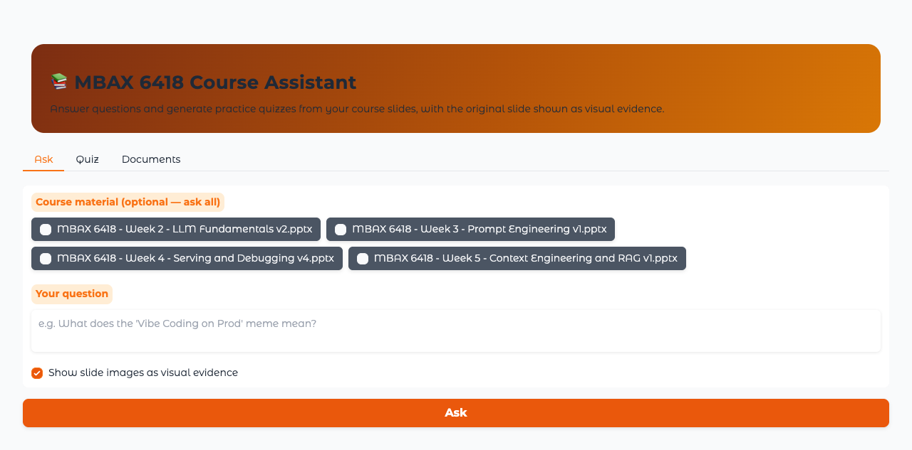

# MBAX 6418 Course Assistant (RAG Study Assistant)

A hybrid retrieval-augmented-generation (RAG) app that answers questions and
generates practice quizzes **from your course slides**, showing the original
slide/image as visual evidence beside every answer. It answers only from the
loaded material — when the documents don't contain the answer it says so rather
than guessing — and keeps quiz answer keys hidden until you answer or request
them. Built for MBAX 6418 (LLMs for Business, CU Boulder) using the class
endpoints.

## Screenshots

Ask — answer with the retrieved **"Vibe Coding on Prod"** slide (Week 2, slide 33) shown as evidence:


Quiz — scored feedback with explanations and cited sources (real quiz generated
offline from the Week 5 deck):


App in light mode (light/dark both verified — app follows OS/browser color scheme):



## Architecture


## Pipeline

**Step 1 — Document preparation** (`core/parsing.py`)
Uploads (`.pptx`, `.pdf`, `.docx`, `.txt`, `.md`) are parsed page/slide by page
with PyMuPDF: text is extracted **and** every page/slide is rendered to a PNG.
`.pptx` is first converted to PDF by headless **LibreOffice** (`soffice`); DOCX
and TXT are read directly; anything else is rejected with a clear message.

**Step 2 — Chunking** (`core/chunking.py`)
Text is split with LangChain splitters (recursive by default, fixed-size as an
option). Every chunk keeps its `doc_id`, `doc_name`, slide/page number, and the
slide image path, so any chunk that matches can show the supporting slide.

**Step 3 — Indexing: text and visual kept separate** (`core/index.py`)
- **Text index** — each chunk goes into a **bm25s** keyword index *and* a
  Chroma vector store (text embeddings from the class endpoint).
- **Visual index** — a separate Chroma collection of slide-**image** embeddings
  (visual embeddings from the class endpoint) so visual/diagram questions
  retrieve the actual slides.
A JSONL chunk registry and the PNG renders persist under `./data` (gitignored);
embeddings live in Chroma's persistent store (`data/chroma`).

**Step 4 — Retrieval → rerank → answer** (`core/assistant.py`)
A query is run through keyword + text-vector + visual-image retrieval, the
candidate chunk ids are merged and deduped, then **reranked** (class reranker;
lexical fallback offline). The best evidence — including the relevant slide
*images* — is sent to the class vision LLM with instructions to answer only
from that evidence, producing structured output with separate `answer` and
`sources` fields. `core/quiz.py` builds MCQs from the same retrieval with a
hidden answer key, scoring, and explanations that cite their slide source.

## Class services

The app itself (Gradio + prep + indexing + retrieval) runs locally; the models
run on the **class endpoints at `http://dobolyi.com:9001+`** (OpenAI-compatible
`/v1`). Keys are read from the environment or a local `.env` (gitignored) and
**never appear in the UI, logs, or this repo** — `.env.example` ships dummy
values only.

| Var | Purpose | Class default |
|---|---|---|
| `COURSE_LLM_BASE_URL` / `COURSE_LLM_MODEL` | vision-capable answer LLM | `http://dobolyi.com:9001/v1` |
| `COURSE_TEXT_EMBED_BASE_URL` / `_MODEL` | text embeddings | `:9002/v1` |
| `COURSE_VISUAL_EMBED_BASE_URL` / `_MODEL` | image embeddings | `:9003/v1` |
| `COURSE_RERANK_BASE_URL` / `_MODEL` | text/multimodal reranker | `:9004/v1` |
| `COURSE_PARSE_BASE_URL` (optional) | doc-parsing service | `:9005/v1` |
| `COURSE_API_KEY` | bearer key for the above | `dummy` |
| `CHUNK_SIZE` / `CHUNK_OVERLAP` | text chunking | `1200` / `150` |
| `COURSE_BUILD_MODE` | `local` (offline) or `full` (live services) | `local` |

> Confirm exact ports/models with your professor. Without live keys,
> `COURSE_BUILD_MODE=local` keeps the app fully usable (retrieval, evidence,
> offline questions) so it runs out of the box; answers use a local fallback and
> quiz questions are generated deterministically from the slides until the live
> LLM is configured.

## Data

- `data/materials/` — course decks to ingest (not committed; add yours).
- `data/images/` — rendered slide PNGs, one per page (gitignored).
- `data/text_chunks.jsonl`, `data/chroma/` — chunk registry + vector stores.
- `results/comparison.json` — RAG comparison results (committed).
- `seed_data.py` — ingests the course decks present in `data/materials`.

## Setup

```bash
python3 -m venv .venv
.venv/bin/pip install -r requirements.txt    # or: pip install -e ".[dev]"
cp .env.example .env                          # fill in class endpoints + key (never commit)
python seed_data.py                           # optional: ingest bundled decks
.venv/bin/python -m course_assistant.ui.app   # -> http://127.0.0.1:7860
```

Requires Python 3.11+ and **LibreOffice** for PPTX→PDF
(`brew install --cask libreoffice`). Plain PDFs need neither.

## Running

- **Documents** tab — add/remove files. Re-adding the same file is detected by
  content hash and skipped; removing a file drops its chunks *and* slide
  images, so later answers can't use it.
- **Ask** tab — pick decks (or ask all), type a text or visual question (e.g.
  "what does the *Vibe Coding on Prod* meme mean?"), and **Ask**. The answer
  cites document + slide/page, lists source excerpts, and shows the relevant
  slide images. Unanswerable questions trigger a clear "not in the material"
  reply.
- **Quiz** tab — pick decks, a topic, and a count, then generate. Answer the
  MCQs and **Grade** for score + explanations, or **Show answers**; the key
  stays hidden until then.
- **Light / dark** — both render correctly (app follows your OS/browser color
  scheme).

## Evaluation & comparison

Question set (covers slide text + syllabus; ≥2 visual; 1 unanswerable):

| # | Question | Type | Expected |
|---|---|---|---|
| 1 | What is retrieval-augmented generation (RAG)? | text | W5 · slide 10 |
| 2 | Why use RAG? (benefits over training data) | text | W5 · slide 11 |
| 3 | What two components does hybrid RAG combine? | text | W5 · slide 18 |
| 4 | What does the *Vibe Coding on Prod* meme show? | **visual** | W2 · slide 33 |
| 5 | Describe the hybrid-RAG pipeline diagram | **visual** | W5 · slide 18 |
| 6 | What port does Gradio serve on by default? | text | W4 · slide 7 |
| 7 | What is semantic search typically based on? | text | W5 · slide 15 |
| 8 | Name two common chunking strategies | text | W5 · slide 17 |
| 9 | Who won the 2024 Super Bowl and by how much? | **unanswerable** | — |
| 10 | How does RAG context optimization differ from fine-tuning? | text | W5 · slide 13 |

Results (same questions, same files; retrieval-correct = target slide in the
top-3, mean end-to-end query latency) — full rows in `results/comparison.json`:

| Config | Retrieval correct (top-3) | Mean latency | Unanswerable → top-1 |
|---|---|---|---|
| rerank on · recursive chunking | **9/10** | 1.5 ms | slide 8 (spurious) |
| rerank off · recursive chunking | 9/10 | 1.2 ms | slide 8 (spurious) |
| rerank on · fixed chunking | 9/10 | 1.3 ms | slide 8 (spurious) |

**Interpretation.** All three configs recover the target slide for the 9
answerable questions, so we keep **rerank on + recursive chunking**: it is the
architecturally correct hybrid pipeline described in class, reranking will
separate strong from weak candidates once real semantic embeddings are enabled,
and recursive (paragraph-aware) chunking keeps topic sentences intact versus
fixed splits that break mid-sentence — at negligible latency overhead (~0.3 ms).
The unanswerable control still returns a spurious top-1 slide offline because
hash embeddings always return *something*; this is exactly why missing-info
detection is handled in the answer stage (which needs the live semantic LLM). It
is a documented limitation, not a fabricated success.

## Testing

```bash
.venv/bin/python -m pytest -q
```

25 tests: parsing (incl. a real PPTX → slide images), chunking, add/dedupe/
remove/visual-search, structured answer/sources, missing-info refusal, quiz
scoring + hidden key, plus end-to-end handler workflows. Deck-dependent tests
auto-skip on a fresh clone; the served app is also verified over its real HTTP
event API (`/ask` returns the grounded answer + the slide-33 image).

## Limitations

- Real semantic retrieval (visual embeddings, class reranker, vision LLM) is
  stubbed offline (`COURSE_BUILD_MODE=local`) pending live keys.
- `.pptx` text comes from the LibreOffice-rendered PDF text layer; very
  image-heavy slides yield little text (the visual index compensates by showing
  the actual slide).
- Offline retrieval can't detect "no evidence" semantically — handled in the
  answer stage; needs the live LLM to be reliable.
- No auth — course use only.

## Files

```
src/course_assistant/
  config/settings.py      env + .env (secrets), dummy defaults
  services/               OpenAI-compatible clients + local fallbacks
    embeddings.py chat.py reranker.py
  core/
    parsing.py            uploads -> pages + rendered slide images (LibreOffice)
    chunking.py           recursive / fixed chunkers
    index.py              BM25 + Chroma text & visual indexes, dedupe/remove
    assistant.py          retrieval -> evidence -> {answer, sources}
    quiz.py               grounded MCQs, hidden key, scoring
  ui/app.py               Gradio UI (Ask / Quiz / Documents)
  factory.py              composition root (no Gradio dep), testable
tests/                    unit + e2e (offline)
eval_compare.py           the comparison above -> results/comparison.json
diagram.svg               architecture diagram (embedded above)
docs/                     screenshots
requirements.txt          install deps
```
